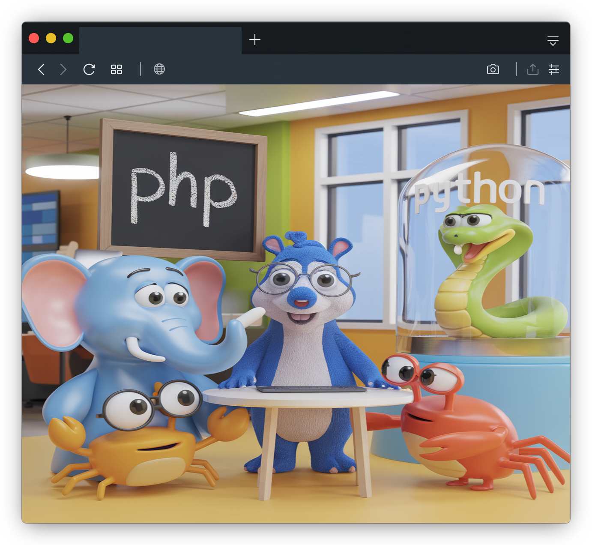

<!-- SE ESSE TEMPLATE TE AJUDOU, POR GENTILEZA, DEIXE UMA ⭐ E FAÇA UM AMIGO :) -->
<!-- INFORMAÇÕES INICIAIS:
  - O template está com os campos descritos em português-br apenas para facilitar a localização dos campos na hora de montar o seu readme.
  - Normalmente, os readmes são feitos preferencialmente em INGLÊS para que qualquer pessoa consiga ler e entender o seu projeto mais facilmente.
  - Além dos campos em português, adicionei comentários antes de algumas seções para facilitar o entendimento do código
 -->

<!-- Âncora para referênciar e voltar ao topo (clicar no botão "back to top" vai voltar para aqui) -->

<!-- LOGO DO SEU PROJETO -->
  

<!-- ADICIONE O LINK DO SEU REPOSITORIO AQUI -->
  

<h3 align="center" style="font-size: 36px;">Título do Projeto</h3>

  

    Este repositório oferece um template de README personalizável para projetos no GitHub. Ele inclui seções essenciais como "About", "Installation", "Usage" e "Contributing", proporcionando uma estrutura organizada e profissional para documentar qualquer projeto, facilitando a criação de README’s de forma eficiente e atraente.
     
     
     
    
<!-- OPCÕES DE LINKS RÁPIDOS -->

  <a href="https://github.com/orafael-almeida/my-projectsReadme-template">🔗View Demo</a>  
  ·  
  <a href="https://github.com/orafael-almeida/my-projectsReadme-template/issues/new?labels=bug&template=bug-report---.md">🐞 Report Bug</a>  
  ·  
  <a href="https://github.com/orafael-almeida/my-projectsReadme-template/issues/new?labels=enhancement&template=feature-request---.md">💡 Request Feature</a>

  

    <!-- LINK DA DOCUMENTAÇÃO DO PROJETO ( SE EXISTIR ) -->
    <a href="https://github.com/orafael-almeida/my-projectsReadme-template"><strong>« documentation »</strong></a>

<!-- INDICE DO SEU README. Não esquecer de colocar as tags para referenciar o click -->

  
Table of Contents

  <ol>
    <li>
      <a href="#about-the-project">About The Project</a>
      <ul>
        <li><a href="#built-with">Built With</a></li>
      </ul>
    </li>
    <li>
      <a href="#getting-started">Getting Started</a>
      <ul>
        <li><a href="#prerequisites">Prerequisites</a></li>
        <li><a href="#installation">Installation</a></li>
      </ul>
    </li>
    <li><a href="#usage">Usage</a></li>
    <li><a href="#roadmap">Roadmap</a></li>
    <li><a href="#contributing">Contributing</a></li>
    <li><a href="#license">License</a></li>
    <li><a href="#contact">Contact</a></li>
    <li><a href="#acknowledgments">Acknowledgments</a></li>
  </ol>

<!-- Sobre o projeto -->
## About The Project

  <!-- Imagem com contorno -->
  

## Main Features

- **Customizable Template**: Fácil de adaptar e personalizar para diferentes tipos de projetos.
- **Sections Included**: Inclui seções essenciais como "About", "Installation", "Usage", "License" e "Contributing".
- **Quick Setup**: Preparado para ser usado imediatamente com uma estrutura bem organizada.
- **Clear Structure**: Comentários explicativos para ajudar a entender o que cada seção faz e como preenchê-la.
- **Multi-Language Support**: Inicialmente com campos em português, mas facilmente adaptável para inglês ou outros idiomas.
- **Responsive Design**: Template visualmente agradável e adequado para diferentes tipos de projetos no GitHub.
- **Linkable Table of Contents**: Navegação rápida entre as seções usando links de ancoragem.

(<a href="#readme-top">back to top</a>)

